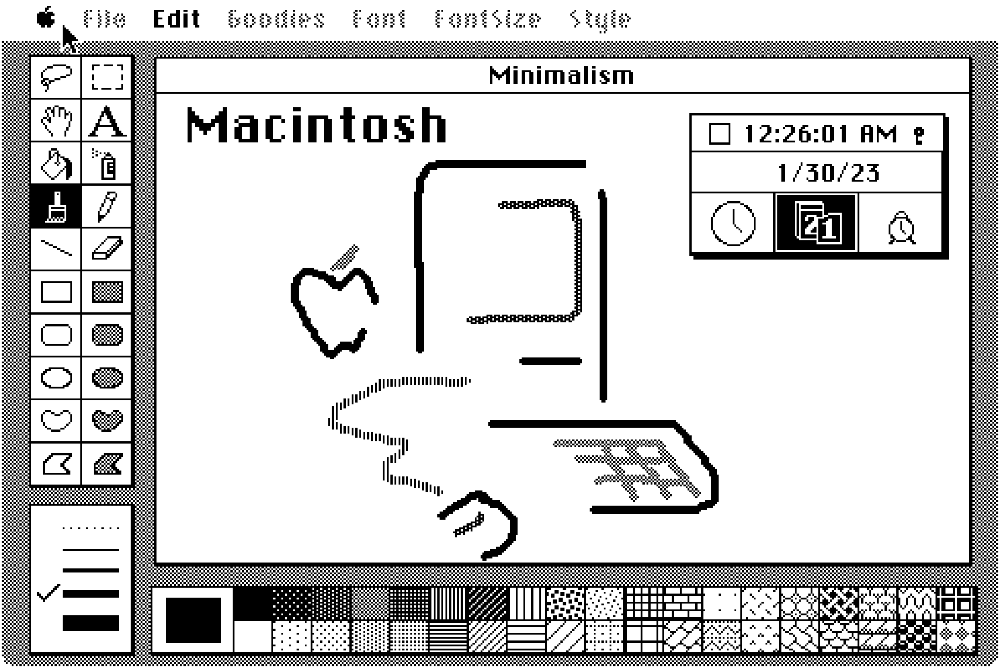

# Genuary 2023

My code from the Genuary2023 prompts https://genuary.art/prompts

Additionnal constraint in most challenge for Computer Museum NAM-IP: retro style/connection
see on Twitter: #genuary2023 @computerMusemB https://twitter.com/search?q=%23genuary2023%20from%3A%20%40ComputerMuseumB&src=typed_query

Languages: BASIC (CPC,C64), Turbo Pascal, Python (PyGame), P5JS, Three.js (WEBGL), Scratch

## Gallery

See complete material in results subdirectory

### Day 1 - Perfect Loop 

### Day 2 - Made in 10 minutes

### Day 3 - Glitch Art

### Day 4 - Intersections

### Day 5 - Debug view

### Day 6 - Steal like an artist

### Day 7 - Sample a color palette from your favorite movie/album cover

### Day 8 - Signed Distance Functions

### Day 9 - Plants

### Day 10 - Generative Music

### Day 11 - Suprematism

### Day 12 - Tessallation

### Day 13 - Something you’ve always wanted to learn

### Day 25 - Yayoi Kusama

### Day 29 - Maximalism

### Day 30 - Minimalism

