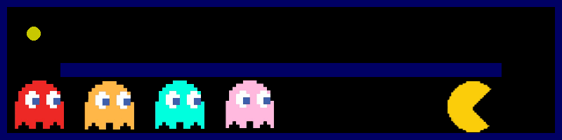
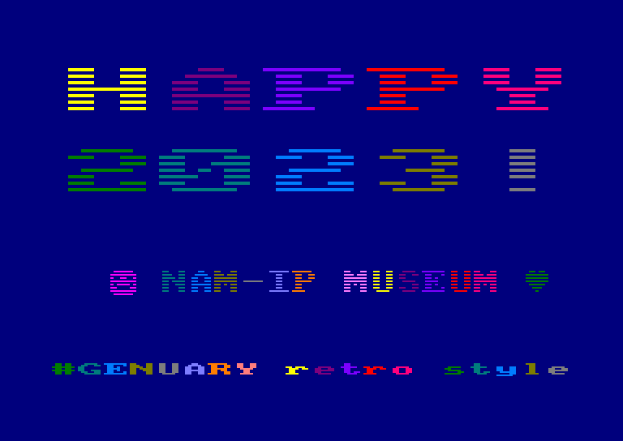
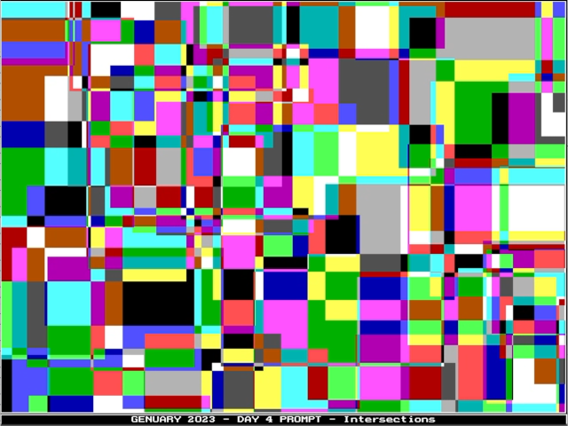
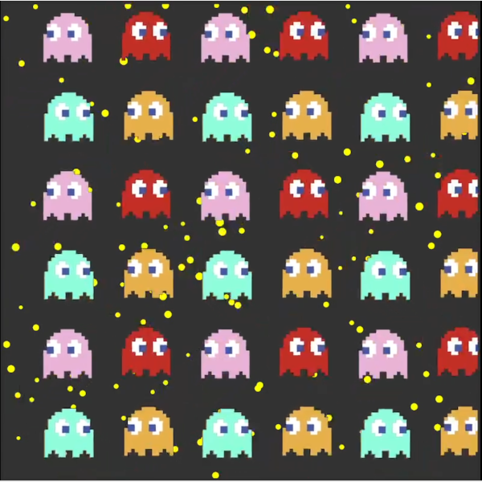
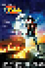
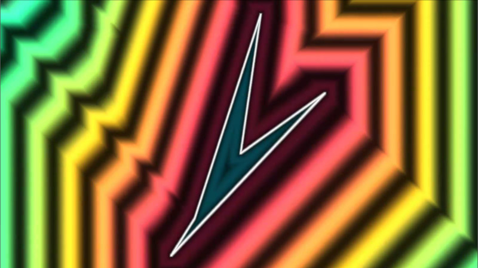
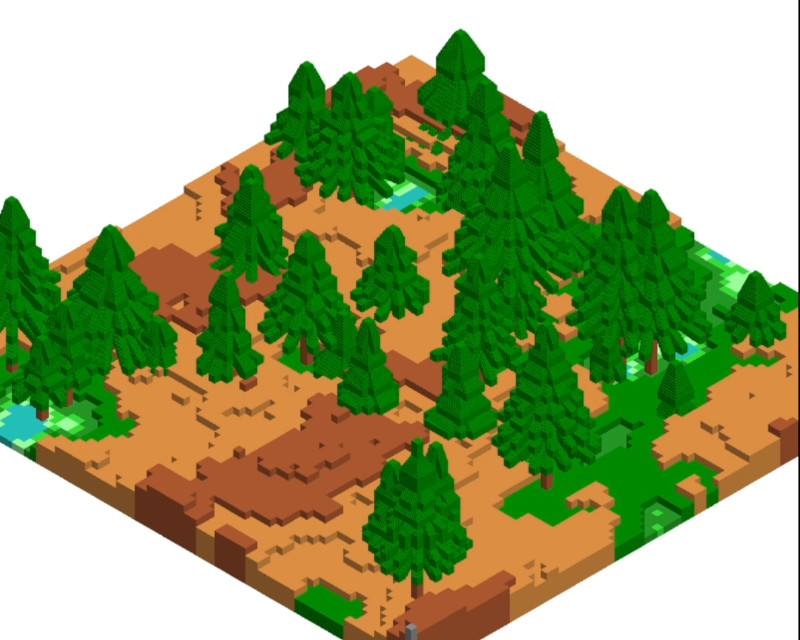
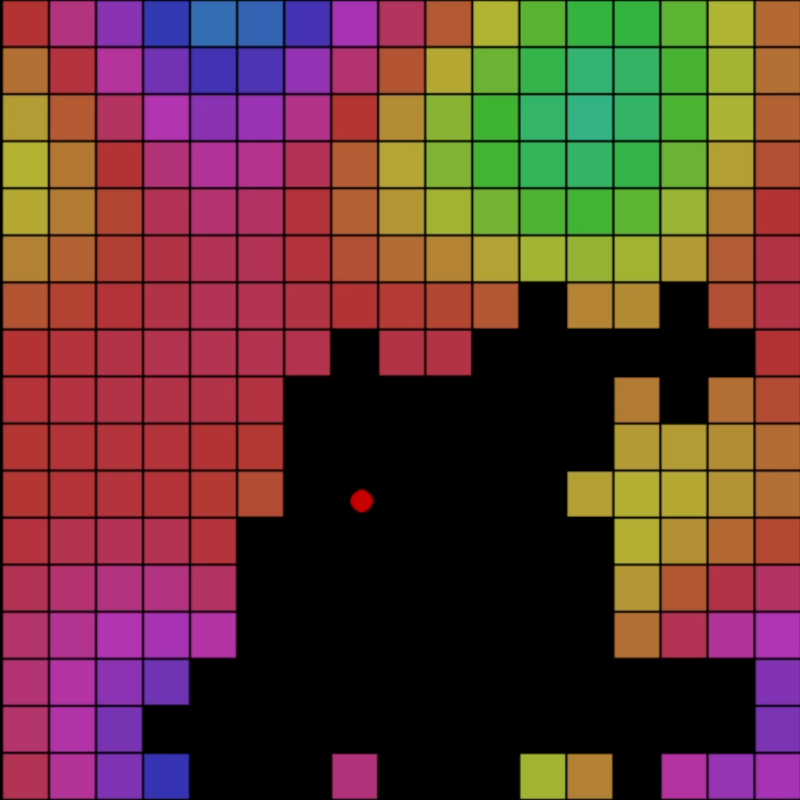
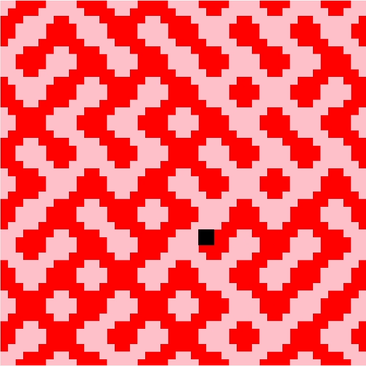
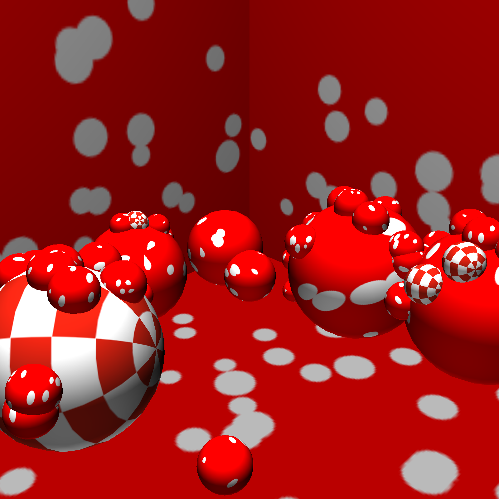

# Genuary 2023

My code from the Genuary2023 prompts https://genuary.art/prompts

Additionnal constraint in most challenge for Computer Museum NAM-IP: retro style/connection
see on Twitter: #genuary2023 @computerMusemB https://twitter.com/search?q=%23genuary2023%20from%3A%20%40ComputerMuseumB&src=typed_query

Languages: BASIC (CPC,C64), Turbo Pascal, Python (PyGame), P5JS, Three.js (WEBGL), Scratch

## Gallery

See complete material (video versions) in the results subdirectory. Click to see video (when available)

<table>
<tr> 
  <td align="center"> <b>Day 1 - Perfect GIF Loop</b></a></td>
  <td align="center"> <b>Day 2 - Made in 10 minutes</b></a></td>
  <td align="center"> <b>Day 3 - Glitch Art</b></a></td>
</tr>
<tr>
  <td style="vertical-align: top;"><b>Day 1 - Perfect Loop</b>    </td>
  <td style="vertical-align: top;"><b>Day 2 - Made in 10 minutes</b>  </td>
  <td style="vertical-align: top;"><b>Day 3 - Glitch Art</b>   </td>
</tr>
<tr>
  <td><b>Day 4 - Intersections</b>    </td>
  <td><b>Day 5 - Debug view</b>    </td>
  <td><b>Day 6 - Steal like an artist</b>    </td>
</tr>
<tr>
  <td><b>Day 7 - Sample a color palette from your favorite movie/album cover</b>   </td>
  <td><b>Day 8 - Signed Distance Functions</b>   </td>
  <td><b>Day 9 - Plants</b>   </td>
</tr>
 <tr>
  <td><b>Day 10 - Generative Music</b>   </td>
  <td><b>Day 11 - Suprematism</b>   </td>
  <td><b>Day 12 - Tessallation</b>   </td>
</tr>
   <tr>
  <td><b>Day 13 - Something you’ve always wanted to learn</b>   </td>
  <td><b>Day 14 - Aesemic</b>   </td>
  <td><b>Day 15 - Sine waves</b>   </td>
</tr> 
   <tr>
  <td><b>Day 16 - Reflection of a reflection</b>   </td>
  <td><b>Day 17 - A grid inside a grid inside a grid</b>   </td>
  <td><b>Day 18 - Definitely not a grid</b>   </td>
</tr> 
<tr>
  <td><b>Day 19 - Black and white</b>   </td>
  <td><b>Day 20 - Art Deco</b>   </td>
  <td><b>Day 21 - Persian Rug</b>   </td>
</tr>
<tr>
  <td><b>Day 22 - Shadows</b>   </td>
  <td><b>Day 23 - More Moiré</b>   </td>
  <td><b>Day 24 - Textile</b>   </td>
</tr> 
<tr>
  <td><b>Day 25 - Yayoi Kusama</b>   </td>
  <td><b>Day 26 - My kid could have made that</b>   </td>
  <td><b>Day 27 - In the style of Hilma Af Klint</b>   </td>
</tr> 
<tr>
  <td><b>Day 28 - Generative poetry</b>   </td>
  <td><b>Day 29 - Maximalism</b>   </td>
  <td><b>Day 30 - Minimalism</b>   </td>
</tr> 
 <tr>
  <td><b>Day 31 - Deliberately break one of your previous images, take one of your previous works and ruin it</b>   </td>
  <td></td>
  <td></td>
</tr> 
</table>
