# Genuary 2023

My code from the Genuary2023 prompts https://genuary.art/prompts

Additionnal constraint in most challenge for Computer Museum NAM-IP: retro style/connection
see on Twitter: #genuary2023 @computerMusemB https://twitter.com/search?q=%23genuary2023%20from%3A%20%40ComputerMuseumB&src=typed_query

Languages: BASIC (CPC,C64), Turbo Pascal, Python (PyGame), P5JS, Three.js (WEBGL), Scratch

## Gallery

For many days, videos are available in the results subdirectory and also on Youtube (link below the picture). A P5JS link when the prompt was coded in that language.

<!-- IMAGE-LIST:START - Do not remove or modify this section -->
<!-- prettier-ignore-start -->
<!-- markdownlint-disable -->

<table>
<tbody>
<tr>
  <td align="center" valign="top" width="33%"><b>Day 1 - Perfect Loop</b>     Lgge: Python</td>
  <td align="center" valign="top" width="33%"><b>Day 2 - Made in 10 minutes</b>   Lgge: CPC Locomotive BASIC</td>
  <td align="center" valign="top" width="33%"><b>Day 3 - Glitch Art</b>     Lgge: Python/teletext</td>
</tr>
<tr>
  <td align="center" valign="top"><b>Day 4 - Intersections</b>   </a>  Lgge: Turbo Pascal/GDI - <a href="https://www.youtube.com/3yBQybKeCvg">VIDEO</a></td>
  <td align="center" valign="top"><b>Day 5 - Debug view</b>   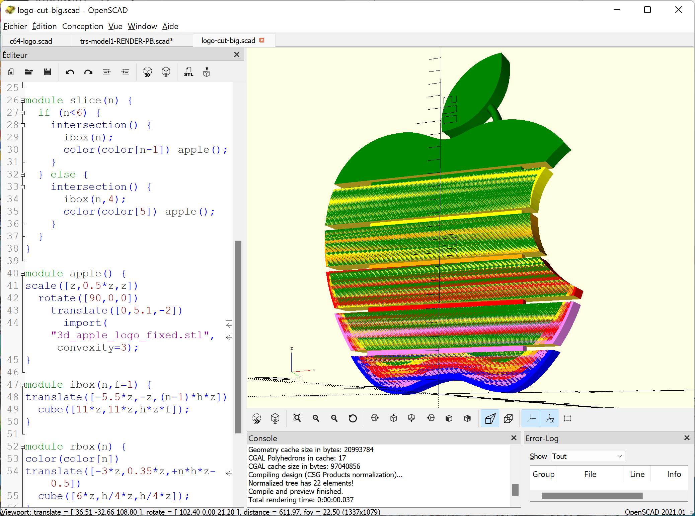  Lgge: OpenScad</td>
  <td align="center" valign="top"><b>Day 6 - Steal like an artist</b>     Lgge: Python - <a href="https://www.youtube.com/shorts/igOCSb6lbYs">VIDEO</a></td>
</tr>
<tr>
  <td align="center" valign="top"><b>Day 7 - Sample a color palette from  your favorite movie/album cover</b>    Lgge: Python - <a href="https://www.youtube.com/shorts/eS4xKI4oZtg">VIDEO</a> </td>
  <td align="center" valign="top"><b>Day 8 - Signed Distance Functions</b>   Lgge: shader - <a href="https://www.youtube.com/watch?v=I5P44xdhEm4">VIDEO</a> </td>
  <td align="center" valign="top"><b>Day 9 - Plants</b>    Lgge: <a href="https://editor.p5js.org/cponsard/sketches/1CqnpvAU-">P5JS</a> - <a href="https://youtu.be/rj--_LJQC1U">VIDEO</a></td>
</tr>
<tr>
  <td align="center" valign="top"><b>Day 10 - Generative Music</b>   Lgge: Python - <a href="https://youtu.be/EZGvFoNR0sI">VIDEO</a></td>
  <td align="center" valign="top"><b>Day 11 - Suprematism</b>    Lgge: <a href="https://editor.p5js.org/cponsard/sketches/nqu61VEeN">P5JS</a> - <a href="https://www.youtube.com/shorts/Xr4ncWf0iEg">VIDEO</a></td>
  <td align="center" valign="top"><b>Day 12 - Tessallation</b>    Lgge: <a href="https://editor.p5js.org/cponsard/sketches/qkiRiRUxP">P5JS</a> - <a href="https://www.youtube.com/shorts/f7vcW4-Olso">VIDEO</a></td>
</tr>
<tr>
  <td><b>Day 13 - Something you’ve always wanted to learn</b>  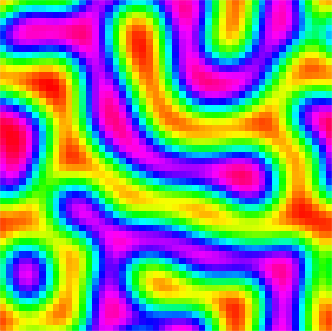  Lgge: Python - <a href="https://youtu.be/Nqsrfxb7XnE ">VIDEO</a></td>
  <td><b>Day 14 - Aesemic</b>  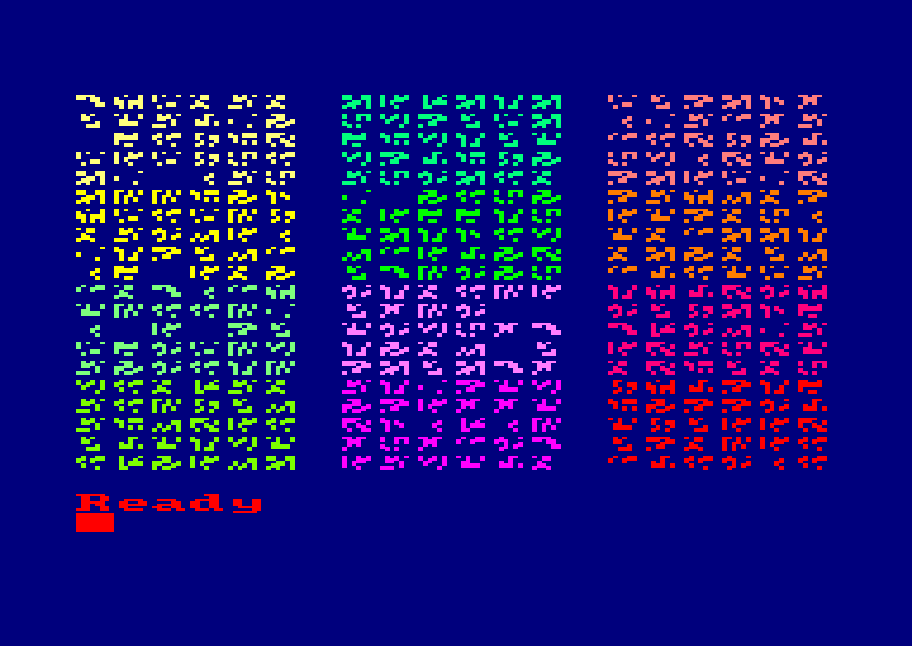  Lgge: CPC Locomotive BASIC - <a href="https://youtu.be/HsMdeRc4qus">VIDEO</a></td>
  <td><b>Day 15 - Sine waves</b>  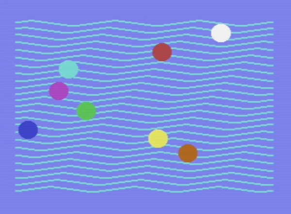  Lgge: C64 BASIC - <a href="https://youtu.be/vI5jI6qu2Hk ">VIDEO</a></td>
</tr>
<tr>
  <td><b>Day 16 - Reflection of a reflection</b>    Lgge: <a href="https://editor.p5js.org/cponsard/sketches/nKNcji5OZ">P5JS</a> - <a href="https://youtube.com/shorts/JTlHhbH6JmU">VIDEO</a></td>
  <td><b>Day 17 - A grid inside a grid inside a grid</b>  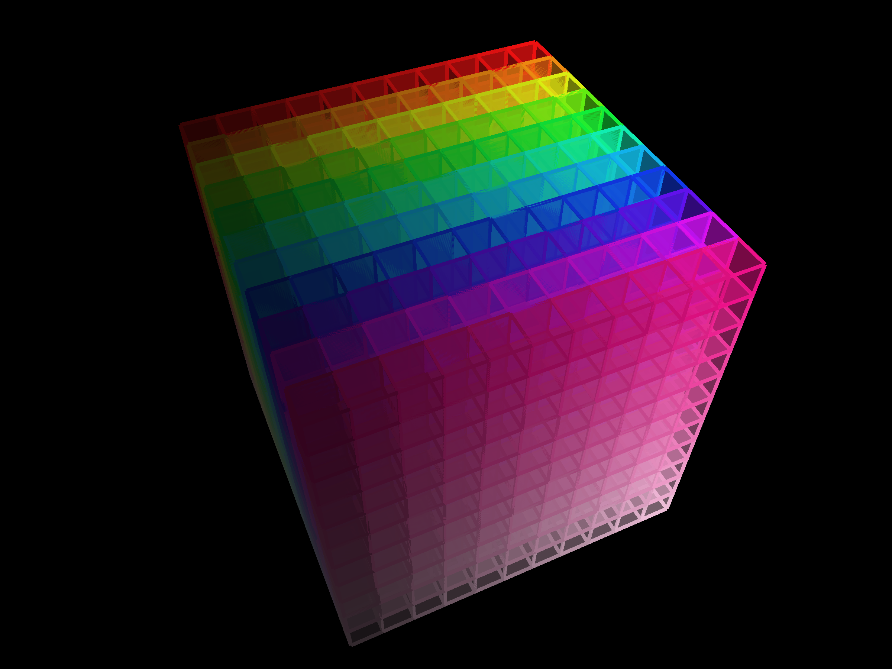  Lgge: <a href="https://editor.p5js.org/cponsard/sketches/HswX4F0HG">P5JS</a> - <a href="https://youtu.be/VYuSfsjL76c">VIDEO</a></td>
  <td><b>Day 18 - Definitely not a grid</b>  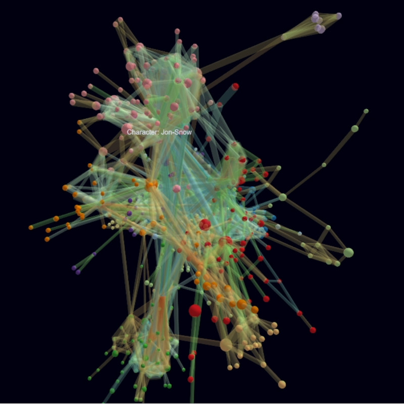  Lgge: Neo4J - <a href="https://youtu.be/1kyGTxODXVs">VIDEO</a></td>
</tr>
<tr>
  <td><b>Day 19 - Black and white</b>  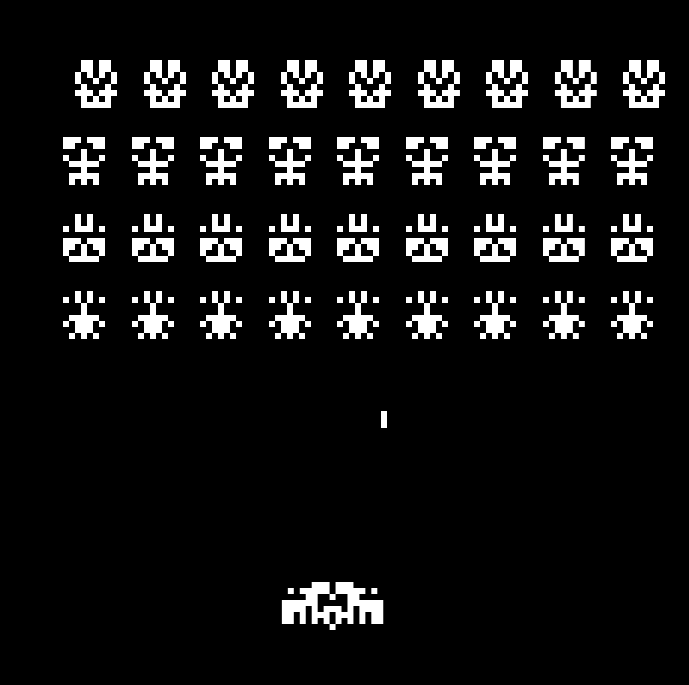  Lgge: <a href="https://editor.p5js.org/cponsard/sketches/2B3URvTcA">P5JS</a> - <a href="https://youtu.be/98-n4ezaltc">VIDEO</a></td>
  <td><b>Day 20 - Art Deco</b>  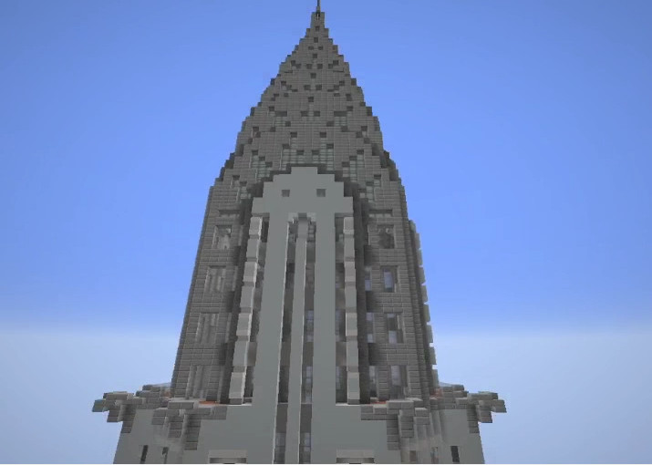  Minecraft - <a href="https://youtu.be/QrrMyiQsGo8">VIDEO</a></td>
  <td><b>Day 21 - Persian Rug</b>  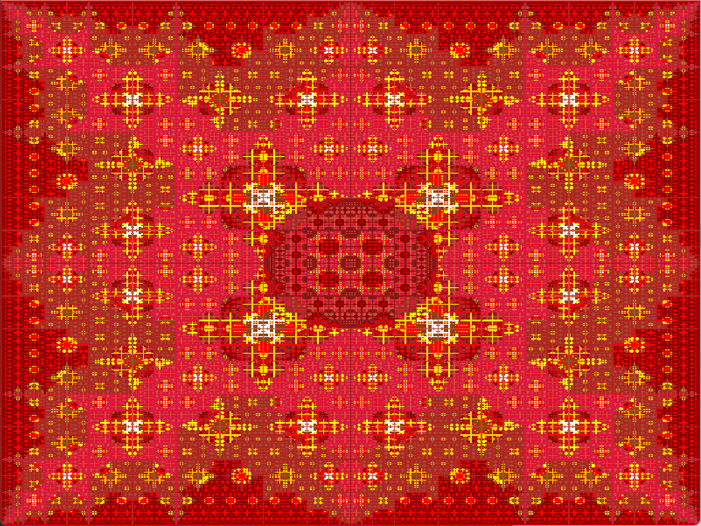  Lgge: Python - <a href="https://youtu.be/ailarL3zwjk">VIDEO</a></td>
</tr>
<tr>
  <td><b>Day 22 - Shadows</b>  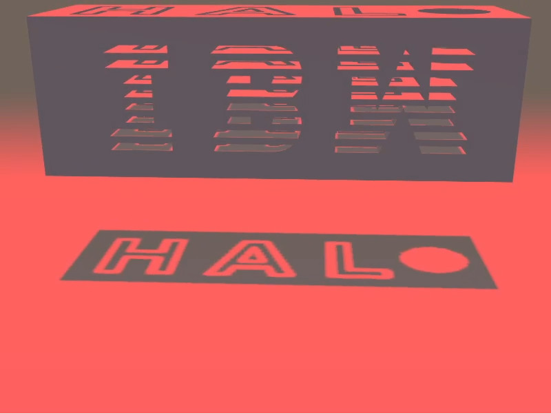  Lgge: Three.js - <a href="https://youtu.be/avU1mYSjhfg">VIDEO</a></td>
  <td><b>Day 23 - More Moiré</b>    Lgge: <a href="https://editor.p5js.org/cponsard/sketches/85-NzBey1">P5JS</a> - <a href="https://youtube.com/shorts/cUxKe6WqMbE">VIDEO</a></td>
  <td><b>Day 24 - Textile</b>  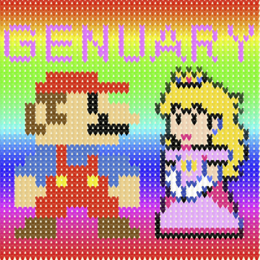  Lgge: <a href="https://editor.p5js.org/cponsard/sketches/yrGzNhVM7d">P5JS</a> - <a href="https://youtube.com/shorts/LwBDkXKq9gA">VIDEO</a></td>
</tr> 
<tr>
  <td><b>Day 25 - Yayoi Kusama</b>    Lgge: <a href="https://editor.p5js.org/cponsard/sketches/ZjvrhmodU">P5JS</a></td>
  <td><b>Day 26 - My kid could have made that</b>    Lgge: <a href="https://scratch.mit.edu/projects/794437743/">Scratch</a> - <a href="https://youtu.be/6Lftylo-zNg">VIDEO</a></td>
  <td><b>Day 27 - In the style of Hilma Af Klint</b>  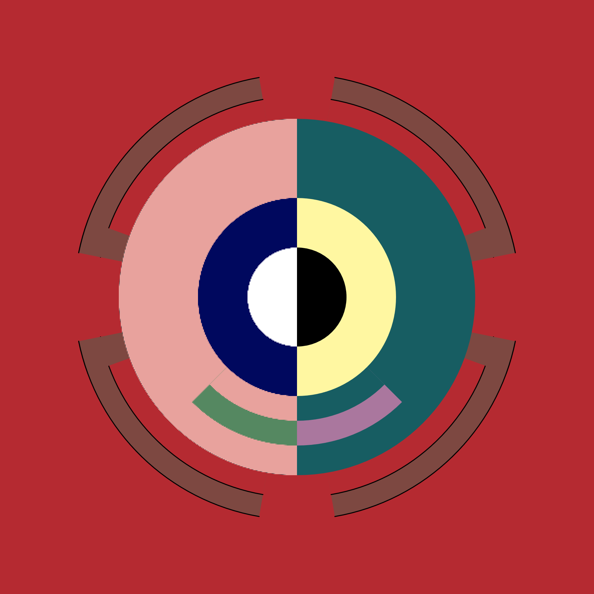  Lgge: <a href="https://editor.p5js.org/cponsard/sketches/9Ya6OvzEA">P5JS</a> - <a href="https://youtube.com/shorts/H5PGB4Achcw">VIDEO</a></td>
</tr> 
<tr>
  <td><b>Day 28 - Generative poetry</b>  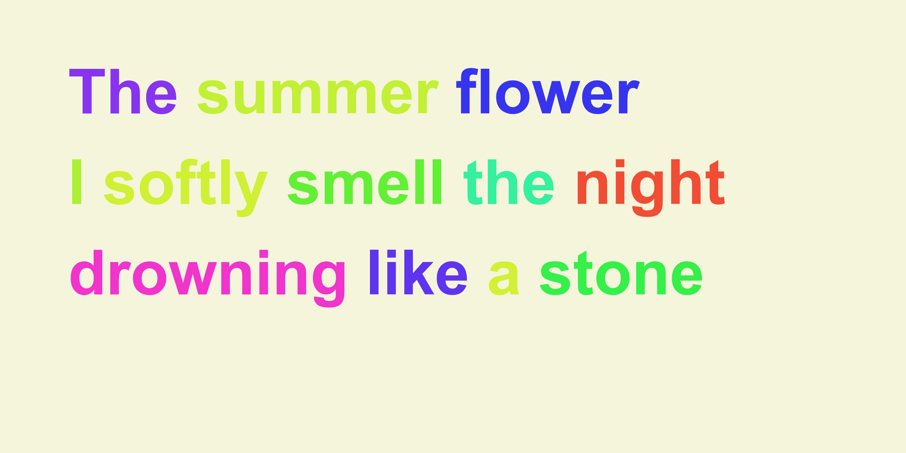  Lgge: <a href="https://editor.p5js.org/cponsard/sketches/lhDVz93fh">P5JS</a> - <a href="https://youtu.be/cvr9ywmQVmg">VIDEO</a></td>
  <td><b>Day 29 - Maximalism</b>    Microsoft Powerpoint</td>
  <td><b>Day 30 - Minimalism</b>    Mac emulator + MacPaint</td>
</tr> 
<tr>
  <td><b>Day 31 - Deliberately break one of your previous images, take one of your previous works and ruin it</b>  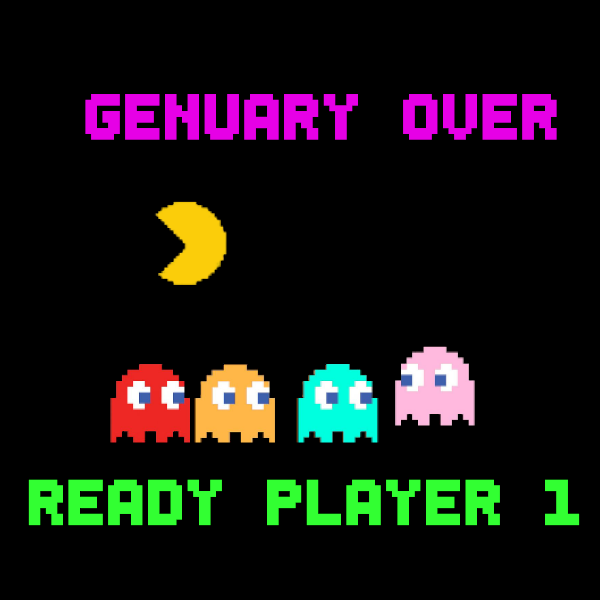  Lgge: Python - <a href="https://youtube.com/shorts/p7u8EkVw3U8">VIDEO</a></td>
</tr>
</tbody>
</table>

<!-- markdownlint-restore -->
<!-- prettier-ignore-end -->

<!-- IMAGE-LIST:END -->
