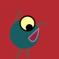

# Genuary 2023

My code from the Genuary2023 prompts https://genuary.art/prompts

Additionnal constraint in most challenge for Computer Museum NAM-IP: retro style/connection
see on Twitter: #genuary2023 @computerMusemB https://twitter.com/search?q=%23genuary2023%20from%3A%20%40ComputerMuseumB&src=typed_query

Languages: BASIC (CPC,C64), Turbo Pascal, Python (PyGame), P5JS, Three.js (WEBGL), Scratch

## Gallery

See complete material (video versions) in the results subdirectory. Click to see video (when available)

<table>
<tr> 
  <td><b>Day 1 - Perfect Loop</b>    </td>
  <td><b>Day 2 - Made in 10 minutes</b>  </td>
  <td><b>Day 3 - Glitch Art</b>   </td>
</tr>
<tr>
  <td><b>Day 4 - Intersections</b>    </td>
  <td><b>Day 5 - Debug view</b>    </td>
  <td><b>Day 6 - Steal like an artist</b>    </td>
</tr>
<tr>
  <td><b>Day 7 - Sample a color palette from your favorite movie/album cover</b>   </td>
  <td><b>Day 8 - Signed Distance Functions/b>   </td>
  <td><b>Day 9 - Plants</b>   </td>
</tr>
 <tr>
  <td><b>Day 10 - Generative Music</b>   </td>
  <td><b>Day 11 - Suprematism</b>   </td>
  <td><b>Day 12 - Tessallation</b>   </td>
</tr> 
</table>

### Day 5 - Debug view

### Day 6 - Steal like an artist

### Day 7 - Sample a color palette from your favorite movie/album cover

### Day 8 - Signed Distance Functions

### Day 9 - Plants

### Day 10 - Generative Music

### Day 11 - Suprematism

### Day 12 - Tessallation

### Day 13 - Something you’ve always wanted to learn

### Day 14 - Aesemic

### Day 15 - Sine waves

### Day 16 - Reflection of a reflection

### Day 17 - A grid inside a grid inside a grid

### Day 18 - Definitely not a grid

### Day 19 - Black and white

### Day 20 - Art Deco

### Day 21 - Persian Rug

### Day 22 - Shadows

### Day 23 - More Moiré

### Day 24 - Textile

### Day 25 - Yayoi Kusama

### Day 26 - My kid could have made that

### Day 27 - In the style of Hilma Af Klint

### Day 28 - Generative poetry

### Day 29 - Maximalism

### Day 30 - Minimalism

### Day 31 - Deliberately break one of your previous images, take one of your previous works and ruin it.

Alternatively, remix one of your previous works.
